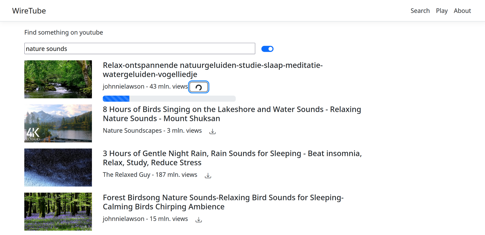
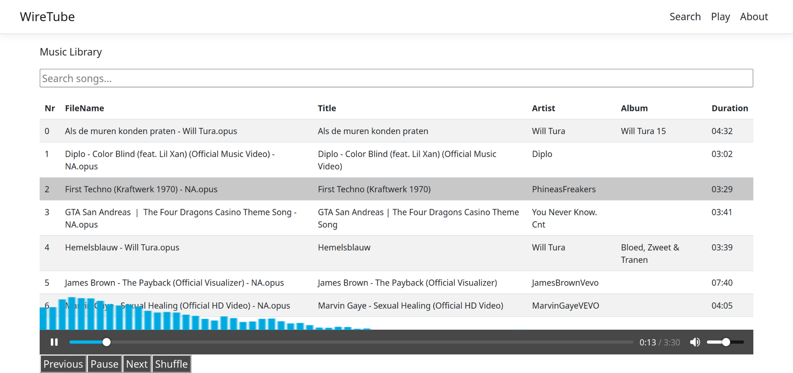
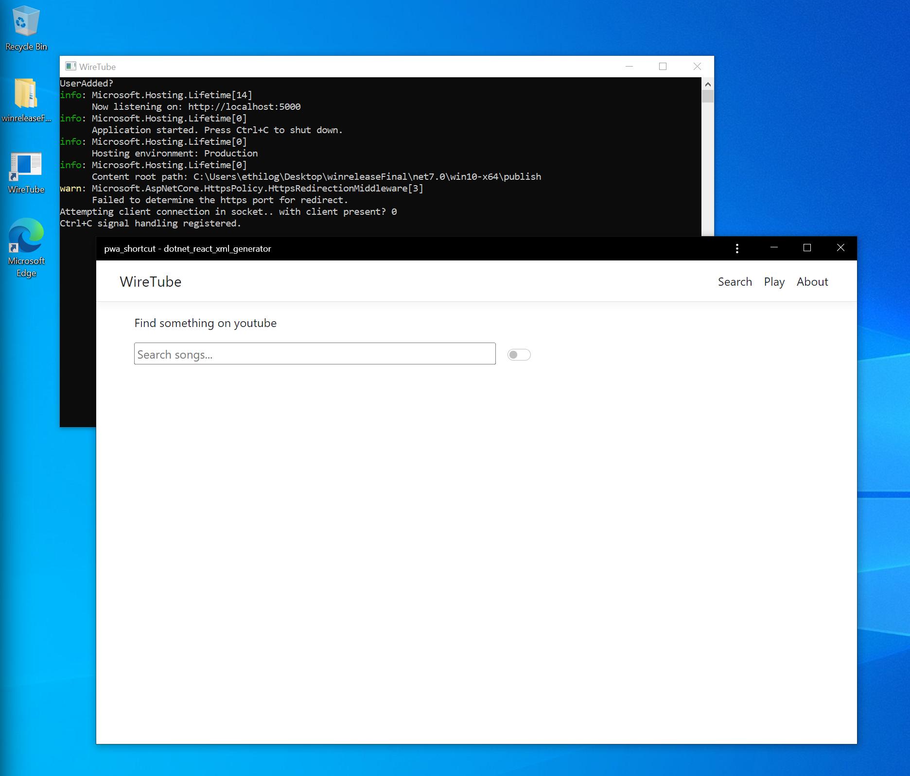

# Background

Search youtube, rip audio (using yt-dlp) and playback in a music library view.

Search & Download | Play
--- | ---
 | 
Toggle between youtube API or scraper searching, the download button splits the best quality audio source from the video and saves it to the library folder. | Basic music library with search, play/pause, skip, random and a visualizer.

# Setup
## 1. Prerequisites
### Youtube API key
One of the two search options is through the Youtube API.  
A Google Cloud Project is used te generate the required API key used in requests, this is free.  
This is recommended as the second option uses scraping and is prone to breaking if the youtube search results structure were to ever change.

Steps
1. google cloud  
https://console.cloud.google.com/apis  
2. create project
    * (lpane) credentials: create credentials > api key  
    * (lpane) enabled api's & services > + enable api's and services > youtube data api

### yt-dlp
The backend processes downloads through yt-dlp (fork of youtube-dl)  
https://github.com/yt-dlp/yt-dlp

## 2. Configuration
Config files:
* `appsettings.json`  
    * SaveFolder = download location and music library  
    * Shortcut = (optional) name of pwa shortcut in project source, if present will aut ostart  
* `ClientApp/.env` (dev) - `ClientApp/publish_config/.env` (prod)
    * react_app_yt_api_key = (optional) insert Youtube API key here

## 3. Running

```shell
dotnet restore
dotnet build
dotnet run
```

# Deployment

### 1. Local
```shell
# multi platform, runtime required
dotnet publish
# Linux, stand alone
dotnet publish -c linuxrelease --self-contained true --runtime linux-x64
# Windows, stand alone
dotnet publish -c windowsrelease --self-contained true --runtime win10-x64
```

**Optional**: make a PWA and configure for auto start

1. Create the PWA  
browse to localhost:5000, then..
    * Chrome: 'three dots' > more tools > create shortcut > name 'pwa_shortcut' and check 'Open as window'
    * Edge: 'three dots' > Apps > install this site as an app > name 'pwa_shortcut'
    * Firefox: not supported

2. Place the created shortcut in the project root  
Example: starting the .NET binary now also starts the PWA app

    <p align='left'></p>

### 2. Docker

Example Docker setup with Dockerfile and docker-compose.yml files included. For the Caddy part a domain name is expected to be managed through Cloudflare.

**REM**: comment `<PublishRunWebpack>` tag in .csproj as frontend build is handled by a seperate container in this Docker setup.

* [Dockerfile](Dockerfile)
    1. .NET build and publish in sdk container 
    2. React build is done in nodejs container
    3. Result of both gets copied to an aspnet (runtime) container

* [docker-compose.yml](docker-compose.yml)
    * Build the .NET container
    * Caddy: reverse proxying and automatic management of certificates through Certbot, in this instance a custom container is built to include the Cloudflare extension

* [caddy](./caddy/)  

    Example Caddyfile in the `file` sub directory, cloudeflare.ini with key te be able to use their api in certificate requests and nested Dockerfile (2 Dockerfiles in same dir not supported)

**REM**: This is a shortened description, my other repository [dnschallenge-sidecar-rproxy](https://github.com/Thomasv7877/dnschallenge-sidecar-rproxy) has more background on these types of setups.

# Functionality:

* React frontend <-> .NET web api backend (communication to and from)  
[ytController.cs](Controllers/ytController.cs) <-> [YoutubeApp.js](ClientApp/src/components/YoutubeApp.js), [MusicPlayerInReact.js](ClientApp/src/components/MusicPlayerInReact.js)  
Implemented through basic Get and Post requests (Fetch js method), the one exception is download progress (next item).
* Passing of download progress to front (Server Side Events endpoint | *alts could have been been: websockets, SignalR*)
https://github.com/Thomasv7877/WireTube/blob/ead03cc2b7e4e6477356feae13493b252fac3ba1/Controllers/ytController.cs#L145-L152
* Execute yt-dlp download (start Process and redirect output)
https://github.com/Thomasv7877/WireTube/blob/e54a4639992432f8b6478cb678b378b86eed1957/Services/YtDlServiceWProgress.cs#L16-L36
* Audio visualizer (Audio Web API)  
[AudioVisualizer.js](ClientApp/src/components/AudioVisualizer.js) ->  
    * audioAnalyzer is run every time a new track is played :  
    Create new audio context > create analyzer on the context + link media to the context (create source) > link analyzer to the source  
    During playback a Uint8Array is constantly refreshed with data, based on this data a canvas can be drawn (with bars for example)
    https://github.com/Thomasv7877/WireTube/blob/17057fd5734ec5e600beb08e36bda02142032a8a/ClientApp/src/components/AudioVisualizer.js#L66-L87
    * waveForm / drawCallback:  
    Every time the data changes in dataArray execute a callback in the callback ->  
    requestAnimationFrame to smooth the transition from one drawing to another > clear canvas > call method to draw the bars -> animateBars
    * animate bars:  
    Calculate the necessary height of the bar per element in the dataArray, the width of each bar is calculated based on the canvas width and the length of the dataArray (add any offset) > define color > fillRect method draws a bar on the canvas
* Search Youtube using the Youtube API
https://github.com/Thomasv7877/WireTube/blob/ead03cc2b7e4e6477356feae13493b252fac3ba1/ClientApp/src/components/YoutubeApp.js#L15-L33
* Search youtube without Youtube API = scraping (HtmlAgilityPack lib)  
[YtSearchService.cs](Services/YtSearchService.cs) ->  
method `searchYtAlt` delegates to 3 helper functions  
    1. `ytSearch` - Do http request (HtmlAgilityPack), first filtering on HtmlDocument (only largest `<script>` tag is needed)
    https://github.com/Thomasv7877/WireTube/blob/17057fd5734ec5e600beb08e36bda02142032a8a/Services/YtSearchService.cs#L21-L31
    2. `parseYtToJson` - convert HtmlDocument to json
    3. `convertJsonToDyn` - get needed video info and convert json to object for returning
* Get audio file info from the backend (TagLibSharp lib)
https://github.com/Thomasv7877/WireTube/blob/ead03cc2b7e4e6477356feae13493b252fac3ba1/Services/YtDlService.cs#L32-L51
* Multi platform auto start of PWA shortcuts  
[PwaManager.cs](Services/PwaManager.cs) ->  
    * Windows: start shortcut but with ProcessStartInfo argument -> `UseShellExecute = true`
    * Linux: More in depth, first the Exec command needs to be extracted from the .desktop shortcut, then it needs to be run from a `sh` command

# Sources

Based on the [.NET React template](https://learn.microsoft.com/en-us/aspnet/core/client-side/spa/react?view=aspnetcore-7.0&tabs=visual-studio).

Docker deployment  
https://medium.com/@mustafamagdy1/netcore-react-docker-1d19f051942c  

Audio visualizer  
https://dev.to/ssk14/visualizing-audio-as-a-waveform-in-react-o67   
https://developer.mozilla.org/en-US/docs/Web/API/Web_Audio_API/Visualizations_with_Web_Audio_API

Youtube API (video search)  
https://developers.google.com/youtube/v3/docs/search/list?apix_params=%7B%22part%22%3A%5B%22classical%20music%22%5D%7D

Html Agility Pack (traversing results)  
https://html-agility-pack.net/traversing

TagLibSharp  
https://github.com/mono/taglib-sharp